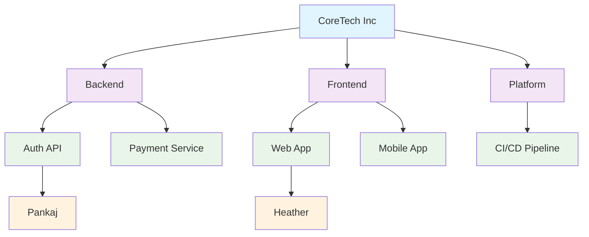
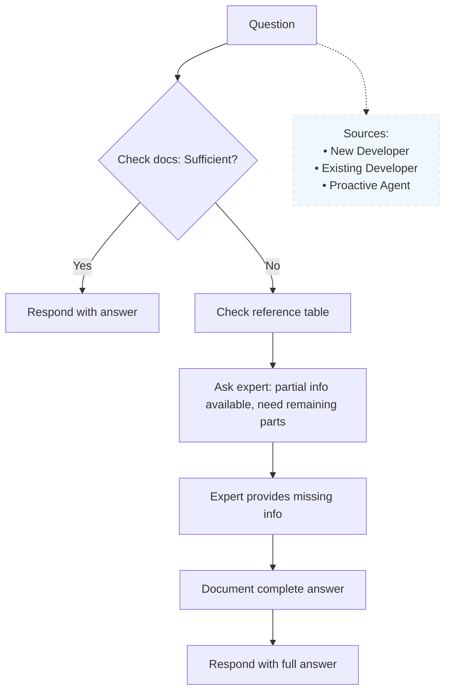

# Scott AI Assistant - Technical Documentation

<!--
DOCUMENT MAINTENANCE RULES:
1. Example Implementation naming: Use realistic, simple names that are immediately recognizable (e.g., "Engineering", "Product") 
2. Avoid generic labels (Department A, B, C) or obscure references that distract from core concepts
3. Names should help readers quickly understand organizational structure without cognitive overhead
4. Examples should be universally familiar to software professionals
5. Prioritize clarity and quick comprehension over creativity in naming
-->

## Reference Organization Structure

Tools: Jira (ticketing), Confluence (documentation)

Company structure:

<!-- Mermaid diagram showing realistic org structure with familiar dept/project names for quick comprehension -->

| Color    | Type    |
| -------- | ------- |
| 🔵 Blue   | Company |
| 🟣 Purple | Team    |
| 🟢 Green  | Project |
| 🟠 Orange | Person  |

## Diagrammatic Representation Opportunities

### From Transcription Content

Elements mentioned in the document that could be visualized:
- **Reference table structure**: Topics → Experts mapping → Knowledge gaps identification
- **Scott workflow diagram**: Developer → Slack → Scott → Internal docs → Response flow
- **Expert routing process**: Scott → Admin → Subject matter expert → Documentation update cycle
- **Ticketing system integration**: Jira ticket → Scott exploration → Expert consultation → Documentation gaps filled
- **Trees/DAGs data structure**: Hierarchical vs graph relationships for distributed tasks
- **Distributed computing network**: Laptop nodes → WebSocket connections → Task distribution → Resource availability states
- **CI/CD integration flow**: Code changes → Documentation check → Update triggers

### Additional Visualization Ideas

New diagram concepts for enhanced understanding:
- System architecture overview (Scott + integrations)
- Decision trees (when Scott escalates vs auto-responds)
- User journey maps (new developer onboarding)
- Network topology (distributed computing setup)

## Project Overview

Scott: AI software app to build.
Goal: maximum information, minimum tokens.

## Core Functionality

Developer questions via Slack trigger Scott's process:

Example: Question about payments → Scott has 60% info → asks Pankaj for remaining 40% → Pankaj responds → Scott documents → complete answer delivered.

## Current Features

Ticketing integration: incoming tickets → Scott explores → asks experts about gaps → puts max info in system.

## Benefits

Benefits: developers don't bother others, gaps found automatically (event-based), questions → Scott answers.
CI/CD: code changes → doc update checks.

## Future Enhancements

### Distributed Computing
Distributed computing: internal laptops for parallel tasks via WebSocket.
Trees/DAGs structure (trees better: references vs children).
Parallelization saves costs.
Developers can disable when needing local power.
Disabled/off/not working → unused compute.

### Proactive Documentation
Intelligent agent asks questions proactively without waiting for developer queries.
Identifies knowledge gaps automatically and fills them before questions arise.

### Caching

Caching: cache the answers to the questions.

### Knowledge Graph
Knowledge Graph: a graph of the knowledge of the company.

### thinking in python

### creating python code for cache to replace all past questions? or something along those lines?

### Chain or thought --> tree of thought --> other prompt engineering techniques.