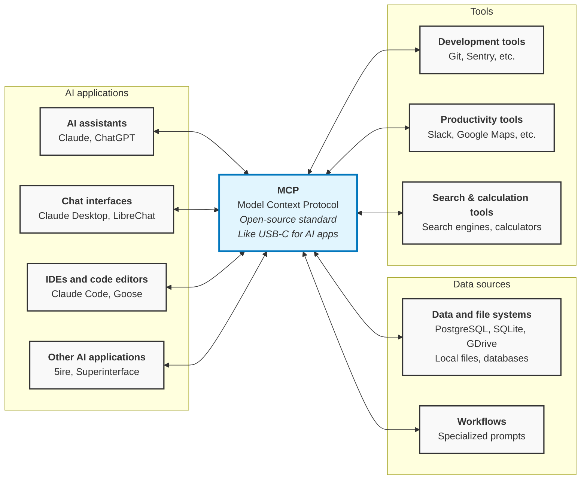

# What is the Model Context Protocol (MCP)?

https://modelcontextprotocol.io/docs/getting-started/intro

MCP (Model Context Protocol) is an open-source standard for connecting AI applications to external systems.

Using MCP, AI applications like Claude or ChatGPT can connect to data sources (e.g. local files, databases), tools (e.g. search engines, calculators) and workflows (e.g. specialized prompts)—enabling them to access key information and perform tasks.

Think of MCP like a USB-C port for AI applications. Just as USB-C provides a standardized way to connect electronic devices, MCP provides a standardized way to connect AI applications to external systems.

## What can MCP enable?

* Agents can access your Google Calendar and Notion, acting as a more personalized AI assistant.
* Claude Code can generate an entire web app using a Figma design.
* Enterprise chatbots can connect to multiple databases across an organization, empowering users to analyze data using chat.
* AI models can create 3D designs on Blender and print them out using a 3D printer.

## Why does MCP matter?

Depending on where you sit in the ecosystem, MCP can have a range of benefits.

* **Developers**: MCP reduces development time and complexity when building, or integrating with, an AI application or agent.
* **AI applications or agents**: MCP provides access to an ecosystem of data sources, tools and apps which will enhance capabilities and improve the end-user experience.
* **End-users**: MCP results in more capable AI applications or agents which can access your data and take actions on your behalf when necessary.

## Start Building

- [Build servers](docs/develop/build-server.md): Create MCP servers to expose your data and tools
- [Build clients](docs/develop/build-client.md): Develop applications that connect to MCP servers

## Learn more

- [Understand concepts](docs/learn/architecture.md): Learn the core concepts and architecture of MCP
