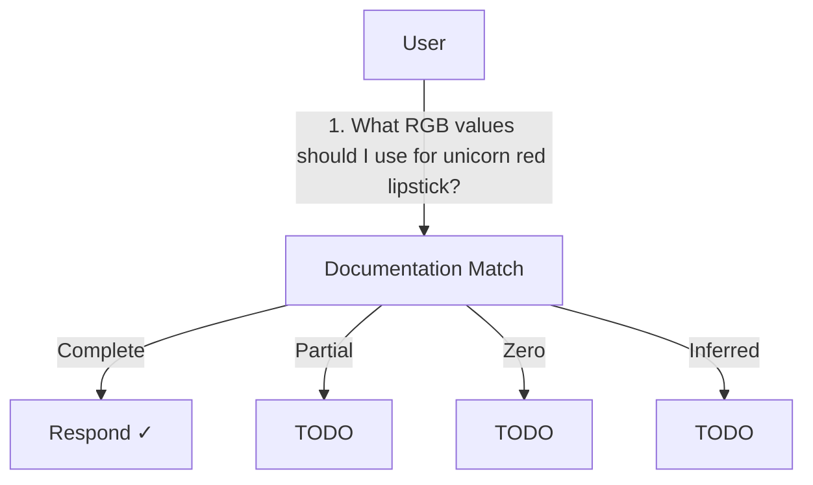
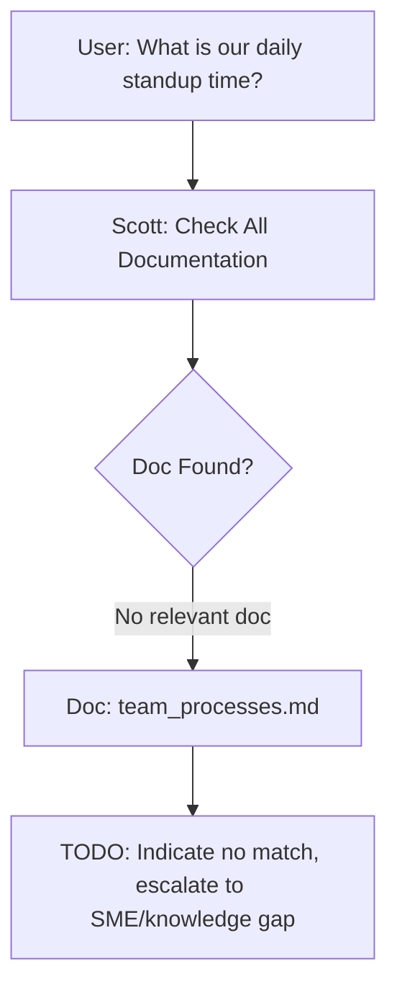

# Project Scott

Product Requirement Document for AI Agents to Answer Questions About Documentation

## Project Maintenance Rules

*   Do not use parentheses in Mermaid diagrams.
*   Do not use double quotes in diagrams.

## User Question Flow



## Demo: Match Type Examples

### 1. Complete Match Example
```mermaid
graph TD
    A[User: What RGB for unicorn red lipstick?] --> B[Scott: Check Color Properties]
    B --> C{Doc Found?}
    C -- Yes --> D[Doc: color_properties.md]
    D --> E[Scott: Extracts (255, 20, 147)]
    E --> F[Respond ✓: (255, 20, 147)]
```

### 2. Partial Match Example
```mermaid
graph TD
    A[User: What RGB for classic red lipstick?] --> B[Scott: Check Color Properties]
    B --> C{Doc Found?}
    C -- Yes --> D[Doc: color_properties.md]
    D --> E[Scott: Extracts (220, 20, 60)]
    E --> G[TODO: Suggest related colors/clarify]
```

### 3. Inferred Match Example
```mermaid
graph TD
    A[User: What is a good pink RGB that resembles unicorn red?] --> B[Scott: Check Color Properties]
    B --> C{Doc Found?}
    C -- No direct match --> D[Doc: hot pink in color_properties.md]
    D --> E[Scott: Infers from similar colors, e.g., Hot Pink (255, 105, 180)]
    E --> I[TODO: Provide inferred RGB with disclaimer]
```

### 4. Zero Match Example


## General Requirements

*   The script should be non-blocking, independent, parallel, and event driven.
