# Technical Interview Preparation Plan

## File Maintenance Rules
- Keep all content in this file, minimum tokens without losing detail
- Capture meta-instructions about file maintenance in this section
- Auto-populate potential questions as they arise
- Include brief answers for quick reference
- Track preparation progress via BFS strategy tree

## Potential Questions

### Glassdoor

**Web Search Results (Latest):**

Searched extensively for specific actual interview questions for EA Full Stack/Software Engineer positions in Burnaby/Vancouver from 2023+ with URLs. 

**Finding:** "Precise details regarding recent interview questions for Full Stack and Software Engineer positions at Electronic Arts (EA) in Burnaby and Vancouver remain elusive across public forums and career sites" - no specific recent questions with URLs found.

**One non-location-specific on-campus EA interview experience found:**
- Floyd-Warshall algorithm
- Virtual functions & OOPS concepts in C++
- RESTful web services
- React.js, Node.js, MongoDB
- Linked lists, array manipulations, puzzles

(No URL provided in search results; described as "single, non-location-specific interview")

**Conclusion:** Public forums lack specific EA Burnaby/Vancouver Full Stack interview questions from 2023+.

#### Manual additions (from user, not web):

#### 1. How do hash maps work internally?
**One-line:** Hash maps use a hash function to convert keys into array indices, storing key-value pairs at those positions with collision handling via chaining or open addressing.

**Structured Answer:**
- **Core structure:** Array + hash function
- **Process:**
  - Key → hash function → array index
  - Store key-value pair at computed index
- **Collision handling:**
  - Chaining: linked lists at each index
  - Open addressing: probe for next empty slot
- **Performance:** O(1) average for insert/lookup/delete
- **Resizing:**
  - Triggered by load factor (typically 0.75)
  - Create larger array, rehash all entries

#### 2. Design end-to-end system for an employee management system (UI + backend)
**Quick Answer (interpreting "set" as "system"):**
- **Frontend:**
  - React/Vue SPA
  - Components: employee list, detail view, CRUD forms
  - State management: Redux/Context
  - Auth: JWT tokens
- **Backend:**
  - REST API (Node/Python/Java)
  - Endpoints: employee CRUD operations
  - Layers: auth middleware, validation
- **Database:**
  - SQL (PostgreSQL)
  - Tables: employees (id, name, email, dept_id, role, hire_date)
  - Relations: foreign keys to departments table
- **Architecture:**
  - Load balancer → API Gateway → App servers → DB
  - Caching: Redis for frequent reads
  - Async: message queue (RabbitMQ/SQS) for notifications
- **Deployment:**
  - Containerization: Docker
  - Orchestration: Kubernetes
  - CI/CD pipeline

## BFS Preparation Strategy - Mermaid Diagram

```mermaid
graph TD
    Root[Tech Interview Prep]
    
    %% Level 1: Sources
    Root --> Daniel[Source 1: Daniel Interviewer Feedback]
    Root --> Glassdoor[Source 2: Glassdoor]
    Root --> Blind[Source 3: Blind TBD]
    Root --> Tyler[Source 4: Tyler Recruiter]
    Root --> Future[Source 5: Future Sources]
    
    %% Daniel Branch
    Daniel --> OOP[Object-Oriented Programming]
    Daniel --> DesignPatterns[Design Patterns]
    Daniel --> DataStruct[Data Structures & Algorithms]
    Daniel --> Architecture[App Architecture MVC]
    Daniel --> MLSetup[ML Parameters & Environment]
    
    %% OOP Subtree
    OOP --> OOP1[Classes & Objects]
    OOP --> OOP2[Inheritance]
    OOP --> OOP3[Polymorphism]
    OOP --> OOP4[Encapsulation]
    OOP --> OOP5[Abstraction]
    
    %% Design Patterns Subtree
    DesignPatterns --> Creational[Creational Patterns]
    DesignPatterns --> Structural[Structural Patterns]
    DesignPatterns --> Behavioral[Behavioral Patterns]
    
    Creational --> Singleton[Singleton]
    Creational --> Factory[Factory Method]
    Creational --> Builder[Builder]
    
    Structural --> Adapter[Adapter]
    Structural --> Decorator[Decorator]
    Structural --> Facade[Facade]
    
    Behavioral --> Observer[Observer]
    Behavioral --> Strategy[Strategy]
    Behavioral --> Command[Command]
    
    %% Data Structures & Algorithms Subtree
    DataStruct --> BigO[Time/Space Complexity Big O]
    DataStruct --> Linear[Linear Structures]
    DataStruct --> TreeStruct[Tree Structures]
    DataStruct --> HashStruct[Hash Structures]
    DataStruct --> GraphStruct[Graph Algorithms]
    DataStruct --> Sorting[Sorting Algorithms]
    
    Linear --> Arrays[Arrays]
    Linear --> LinkedLists[Linked Lists]
    Linear --> Stacks[Stacks]
    Linear --> Queues[Queues]
    
    TreeStruct --> BinaryTree[Binary Trees]
    TreeStruct --> BST[Binary Search Trees]
    TreeStruct --> Balanced[Balanced Trees AVL/Red-Black]
    
    HashStruct --> HashTables[Hash Tables]
    HashStruct --> Sets[Sets]
    HashStruct --> Maps[Maps]
    
    GraphStruct --> DFS[Depth-First Search]
    GraphStruct --> BFS[Breadth-First Search]
    GraphStruct --> Dijkstra[Dijkstra's Algorithm]
    
    Sorting --> QuickSort[QuickSort]
    Sorting --> MergeSort[MergeSort]
    Sorting --> HeapSort[HeapSort]
    
    %% Architecture Subtree
    Architecture --> Model[Model - Data Layer]
    Architecture --> View[View - Presentation Layer]
    Architecture --> Controller[Controller - Logic Layer]
    Architecture --> AltArch[Alternatives MVVM/MVP/Clean]
    
    %% ML Setup Subtree
    MLSetup --> Hyperparams[Hyperparameters]
    MLSetup --> ModelConfig[Model Configuration]
    MLSetup --> TrainEnv[Training Environment]
    MLSetup --> EvalMetrics[Evaluation Metrics]
    
    Hyperparams --> LR[Learning Rate]
    Hyperparams --> BatchSize[Batch Size]
    Hyperparams --> Epochs[Epochs]
    
    ModelConfig --> Layers[Layers]
    ModelConfig --> Activation[Activation Functions]
    
    TrainEnv --> GPU[GPU Setup]
    TrainEnv --> Distributed[Distributed Training]
    
    EvalMetrics --> Accuracy[Accuracy]
    EvalMetrics --> Precision[Precision]
    EvalMetrics --> Recall[Recall]
    EvalMetrics --> F1[F1 Score]
    
    %% Glassdoor Branch
    Glassdoor --> HashMaps[Hash Maps Internal Workings]
    Glassdoor --> SysDesign[System Design Employee Mgmt]
    
    HashMaps --> HashFunc[Hash Function]
    HashMaps --> Collisions[Collision Handling]
    HashMaps --> Performance[O1 Performance]
    HashMaps --> Resizing[Resizing & Load Factor]
    
    Collisions --> Chaining[Chaining Linked Lists]
    Collisions --> OpenAddr[Open Addressing]
    
    SysDesign --> Frontend[Frontend React/Vue SPA]
    SysDesign --> Backend[Backend REST API]
    SysDesign --> Database[Database SQL PostgreSQL]
    SysDesign --> Deploy[Deployment Docker/K8s]
    
    Frontend --> FEComponents[Employee List/Detail/CRUD]
    Frontend --> StateManage[State Management Redux]
    Frontend --> Auth[Auth JWT Tokens]
    
    Backend --> API[REST API Endpoints]
    Backend --> Middleware[Auth Middleware]
    Backend --> Validation[Validation Layer]
    
    Database --> Tables[Tables employees/departments]
    Database --> Relations[Foreign Key Relations]
    
    Deploy --> LB[Load Balancer]
    Deploy --> Cache[Redis Caching]
    Deploy --> Queue[Message Queue RabbitMQ]
    
    %% Styling
    classDef sourceStyle fill:#4A90E2,stroke:#2E5C8A,stroke-width:2px,color:#fff
    classDef topicStyle fill:#7ED321,stroke:#5FA319,stroke-width:2px,color:#000
    classDef subtopicStyle fill:#F5A623,stroke:#C17D11,stroke-width:1px,color:#000
    classDef detailStyle fill:#BD10E0,stroke:#8B0AA8,stroke-width:1px,color:#fff
    
    class Daniel,Glassdoor,Blind,Tyler,Future sourceStyle
    class OOP,DesignPatterns,DataStruct,Architecture,MLSetup,HashMaps,SysDesign topicStyle
    class Creational,Structural,Behavioral,Linear,TreeStruct,HashStruct,GraphStruct,Sorting subtopicStyle
```

### Strategy Notes
- **Approach:** Breadth-first search - organize by source, then cover basics of all topics before going deep
- **Sources:** Daniel (files 35, 36, 37), Glassdoor, Blind, Tyler (pending), more TBD
- **Visualization:** Mermaid diagram captures full hierarchy with color-coded levels (Sources→Topics→Subtopics→Details)
- **Next Action:** Populate Blind nodes; expand with new discoveries
- **Tracking:** Check off topics as mastered; expand tree organically

