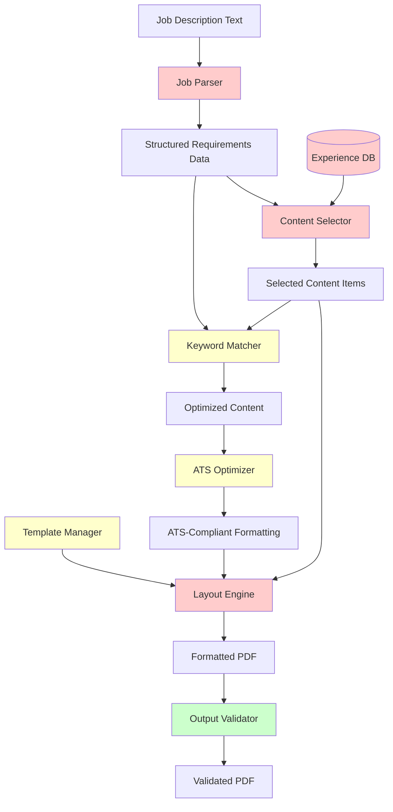

# Project Career - Modular Requirements Analysis

## File Maintenance Rules
- **Minimum tokens**: Use fewest words without losing detail
- **Maximum accuracy**: No fabricated information  
- **Concise with full detail**: Complete information in compact format
- **Use tables & point forms**: Structure data for minimal tokens
- **Progress tracking**: Update status as research progresses
- **Follow these rules**: Apply consistently throughout file maintenance
- **Single responsibility principle**: Each component has one clear purpose
- **Modular approach**: Components work independently and together
- **Backward planning**: Work from end goal to identify requirements

## End Goal Breakdown

**Primary Objective**: Automated, tailored single-page resume generation for each job application

## Component Flow



## Minimum Requirements Table

| Component | Responsibility | Input | Output | Priority | Status |
|-----------|----------------|-------|--------|----------|---------|
| **Job Parser** | Parse job descriptions to extract structured requirements, skills, and qualifications | Job description text | Structured requirements data | Critical | |
| **Content Selector** | Choose relevant experience/skills | Requirements + Experience DB | Selected content items | Critical | |
| **Layout Engine** | Enforce single-page PDF generation | Selected content + Template | Formatted PDF | Critical | |
| **Experience DB** | Store all professional experience | Manual input/updates | Queryable experience data | Critical | |
| **Template Manager** | Handle multiple resume formats | Template selection criteria | Template + styling rules | High | |
| **ATS Optimizer** | Ensure resume passes ATS systems | Generated resume | ATS-compliant formatting | High | |
| **Keyword Matcher** | Align content with job keywords | Job keywords + Content | Optimized content | High | |
| **Output Validator** | Check single-page constraint | Generated PDF | Pass/fail + metrics | Medium | |

## Modular Architecture

### Core Pipeline
```
Job Description → Job Parser → Content Selector → Layout Engine → PDF Output
                     ↓              ↓               ↓
                Requirements → Experience DB → Template Manager
                     ↓              ↓               ↓
                Keyword Matcher → ATS Optimizer → Output Validator
```

### Component Specifications

| Component | Technology Options | Single Responsibility |
|-----------|-------------------|----------------------|
| **Job Parser** | NLP libraries, regex, GPT API | Extract structured data from unstructured job text |
| **Content Selector** | Python logic, ML ranking | Select most relevant experience items |
| **Layout Engine** | WeasyPrint, ReportLab | Generate single-page PDF with precise layout |
| **Experience DB** | JSON, YAML, SQLite | Store and query professional experience |
| **Template Manager** | Jinja2, custom templating | Manage multiple resume formats |
| **ATS Optimizer** | Text analysis, formatting rules | Ensure ATS compatibility |
| **Keyword Matcher** | Text similarity, TF-IDF | Match content to job requirements |
| **Output Validator** | PDF analysis tools | Verify single-page constraint |

## Implementation Strategy

### Phase 1: Core Components (Critical)
- [ ] Experience DB design and implementation
- [ ] Basic job parser (regex-based)
- [ ] Simple content selector (rule-based)
- [ ] Single-page layout engine

### Phase 2: Intelligence Layer (High Priority)
- [ ] Advanced job parser (NLP/GPT)
- [ ] Keyword matching algorithm
- [ ] ATS optimization rules
- [ ] Template management system

### Phase 3: Validation & Polish (Medium Priority)
- [ ] Output validation tools
- [ ] Performance optimization
- [ ] Error handling and logging
- [ ] User interface improvements

## Success Metrics

| Metric | Target | Measurement |
|--------|--------|-------------|
| **Resume Generation Time** | < 30 seconds per job | Automated timing |
| **ATS Pass Rate** | > 95% | Online ATS scanners |
| **Single-page Compliance** | 100% | Automated validation |
| **Content Relevance** | > 80% keyword match | Text analysis |
| **Processing Accuracy** | < 5% manual corrections | User feedback |
| **System Reliability** | > 99% successful runs | Error tracking |

## Dependencies & Constraints

### Technical Dependencies
- Python ecosystem for all components
- PDF generation capabilities
- Text processing libraries
- Template rendering system

### Business Constraints
- Single-page output requirement
- ATS compatibility mandatory
- Fast processing time needed
- High content relevance required
- One resume per job application

## Experience DB Schema

### Experience Statement Progression System

The resume database uses a two-tier progression system for experience statements:

1. **Raw Experience Statements** → 2. **Final STAR Statements**

| Stage | Purpose | Characteristics | Character Limit |
|-------|---------|----------------|-----------------|
| **Raw Experience** | First draft capture | Minimal tokens, maximum detail retention, direct user input | No limit |
| **Final STAR** | Resume-ready | Polished STAR format, optimized for ATS and readability | TBD (to be defined) |

**Workflow**: New experiences start as raw statements, then get directly developed into final resume-ready STAR statements. Existing experiences may already have final STAR statements.

### Core Tables

#### Personal Information
| Field | Type | Required | Description |
|-------|------|----------|-------------|
| `name` | String | Yes | Full name |
| `email` | String | Yes | Contact email |
| `phone` | String | Yes | Phone number |
| `location` | String | Yes | City, State/Country |
| `linkedin` | String | No | LinkedIn profile URL |
| `github` | String | No | GitHub profile URL |
| `website` | String | No | Personal website URL |

#### Experience Entries
| Field | Type | Required | Description |
|-------|------|----------|-------------|
| `id` | String | Yes | Unique identifier |
| `company` | String | Yes | Company name |
| `position` | String | Yes | Job title |
| `start_date` | Date | Yes | Start date (YYYY-MM) |
| `end_date` | Date | No | End date (YYYY-MM), null if current |
| `location` | String | Yes | Work location |
| `description` | String | Yes | Role overview |
| `star_statements` | Array[Object] | Yes | Experience statements with draft and final versions - each object contains "draft" and "final" fields |
| `todo` | Array[String] | No | Action items and improvements needed for this experience entry |
| `technologies` | Array[String] | Yes | Tech stack used |
| `keywords` | Array[String] | Yes | Searchable keywords |
| `impact_metrics` | Array[String] | No | Quantified results from STAR statements |
| `relevance_tags` | Array[String] | Yes | Categories (e.g., "ML", "Backend", "Leadership") |

#### Education Entries
| Field | Type | Required | Description |
|-------|------|----------|-------------|
| `id` | String | Yes | Unique identifier |
| `institution` | String | Yes | School/University name |
| `degree` | String | Yes | Degree type and field |
| `graduation_date` | Date | Yes | Graduation date (YYYY-MM) |
| `gpa` | Float | No | GPA if noteworthy |
| `honors` | Array[String] | No | Awards, honors, distinctions |
| `relevant_coursework` | Array[String] | No | Key courses |

#### Skills
| Field | Type | Required | Description |
|-------|------|----------|-------------|
| `skills` | Array[String] | Yes | Flat array of all skills |

#### Projects (Optional)
| Field | Type | Required | Description |
|-------|------|----------|-------------|
| `id` | String | Yes | Unique identifier |
| `name` | String | Yes | Project name |
| `star_statements` | Array[String] | Yes | STAR format key outcomes |

### Sample JSON Structure
```json
{
  "personal": {
    "name": "John Doe",
    "email": "john.doe@email.com",
    "phone": "+1-555-123-4567",
    "location": "San Francisco, CA",
    "linkedin": "linkedin.com/in/johndoe",
    "github": "github.com/johndoe"
  },
  "experience": [
    {
      "id": "exp_001",
      "company": "Tech Corp",
      "position": "Senior Software Engineer",
      "start_date": "2022-01",
      "end_date": null,
      "location": "San Francisco, CA",
      "description": "Lead backend development for ML-powered platform",
      "star_statements": [
        {
          "draft": "Optimized system architecture resulting in significant performance gains",
          "final": "Improved system performance by 40% through optimization"
        },
        {
          "draft": "Managed engineering team for product delivery", 
          "final": "Led team of 5 engineers on critical product features"
        }
      ],
      "todo": [],
      "technologies": ["Python", "AWS", "Docker", "PostgreSQL"],
      "keywords": ["backend", "machine learning", "leadership", "optimization"],
      "impact_metrics": ["40% performance improvement", "5-person team lead"],
      "relevance_tags": ["ML", "Backend", "Leadership", "Python"]
    }
  ],
  "education": [
    {
      "id": "edu_001",
      "institution": "Stanford University",
      "degree": "M.S. Computer Science",
      "graduation_date": "2020-06",
      "honors": ["Magna Cum Laude"],
      "relevant_coursework": ["Machine Learning", "Distributed Systems"]
    }
  ],
  "skills": ["Python", "JavaScript", "Java", "Go", "AWS", "Docker", "PostgreSQL", "Machine Learning"]
}
```

## Next Actions
1. Implement Experience DB with above schema
2. Prototype job parser with sample descriptions
3. Create basic content selection algorithm
4. Test single-page layout enforcement
