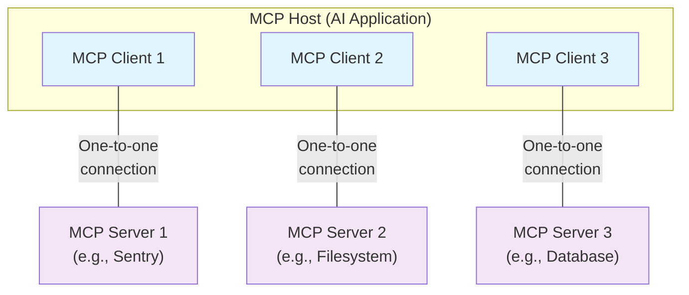

[← Documentation Map](../../documentation-map.md)

---

# Architecture overview

Source: https://modelcontextprotocol.io/docs/learn/architecture

This overview of the Model Context Protocol (MCP) discusses its [scope](#scope) and [core concepts](#concepts-of-mcp), and provides an [example](#example) demonstrating each core concept.

Because MCP SDKs abstract away many concerns, most developers will likely find the [data layer protocol](#data-layer-protocol) section to be the most useful. It discusses how MCP servers can provide context to an AI application.

For specific implementation details, please refer to the documentation for your [language-specific SDK](../sdk.md).

## Scope

The Model Context Protocol includes the following projects:

| Project | Purpose | Details |
|---------|---------|---------|
| [**MCP Specification**](https://modelcontextprotocol.io/specification/latest) | Protocol definition | Implementation requirements for clients & servers |
| [**MCP SDKs**](../sdk.md) | Development libraries | SDKs for different programming languages |
| **MCP Development Tools** | Developer utilities | Server/client dev tools, including [MCP Inspector](https://github.com/modelcontextprotocol/inspector) |
| [**Reference Implementations**](https://github.com/modelcontextprotocol/servers) | Example servers | Reference MCP server implementations |

<Note>
  MCP focuses solely on the protocol for context exchange—it does not dictate
  how AI applications use LLMs or manage the provided context.
</Note>

## Concepts of MCP

### Participants

MCP follows a client-server architecture where an MCP host — an AI application like [Claude Code](https://www.anthropic.com/claude-code) or [Claude Desktop](https://www.claude.ai/download) — establishes connections to one or more MCP servers. The MCP host accomplishes this by creating one MCP client for each MCP server. Each MCP client maintains a dedicated one-to-one connection with its corresponding MCP server.

The key participants in the MCP architecture are:

| Component | Role | Function |
|-----------|------|----------|
| **MCP Host** | AI application | Coordinates & manages multiple MCP clients |
| **MCP Client** | Connection manager | Maintains connection to MCP server, obtains context for host |
| **MCP Server** | Context provider | Provides context data to MCP clients |

**For example**: Visual Studio Code acts as an MCP host. When Visual Studio Code establishes a connection to an MCP server, such as the [Sentry MCP server](https://docs.sentry.io/product/sentry-mcp/), the Visual Studio Code runtime instantiates an MCP client object that maintains the connection to the Sentry MCP server.
When Visual Studio Code subsequently connects to another MCP server, such as the [local filesystem server](https://github.com/modelcontextprotocol/servers/tree/main/src/filesystem), the Visual Studio Code runtime instantiates an additional MCP client object to maintain this connection, hence maintaining a one-to-one
relationship of MCP clients to MCP servers.



Note that **MCP server** refers to the program that serves context data, regardless of
where it runs. MCP servers can execute locally or remotely. For example, when
Claude Desktop launches the [filesystem
server](https://github.com/modelcontextprotocol/servers/tree/main/src/filesystem),
the server runs locally on the same machine because it uses the STDIO
transport. This is commonly referred to as a "local" MCP server. The official
[Sentry MCP server](https://docs.sentry.io/product/sentry-mcp/) runs on the
Sentry platform, and uses the Streamable HTTP transport. This is commonly
referred to as a "remote" MCP server.

### Layers

MCP consists of two layers:

| Layer | Protocol | Responsibilities |
|-------|----------|------------------|
| **Data Layer** | JSON-RPC based | Client-server communication, lifecycle management, core primitives (tools, resources, prompts, notifications) |
| **Transport Layer** | Communication channels | Connection establishment, message framing, authorization between clients & servers |

Conceptually the data layer is the inner layer, while the transport layer is the outer layer.

#### Data layer

The data layer implements a [JSON-RPC 2.0](https://www.jsonrpc.org/) based exchange protocol that defines the message structure and semantics.
This layer includes:

| Feature Category | Purpose | Capabilities |
|------------------|---------|--------------|
| **Lifecycle Management** | Connection handling | Initialization, capability negotiation, termination |
| **Server Features** | Core server functionality | Tools (AI actions), resources (context data), prompts (interaction templates) |
| **Client Features** | Host integration | LLM sampling, user input, message logging |
| **Utility Features** | Additional capabilities | Real-time notifications, progress tracking for long operations |

#### Transport layer

The transport layer manages communication channels and authentication between clients and servers. It handles connection establishment, message framing, and secure communication between MCP participants.

MCP supports two transport mechanisms:

| Transport | Method | Use Case | Benefits |
|-----------|--------|----------|----------|
| **Stdio Transport** | Standard input/output streams | Local processes on same machine | Optimal performance, no network overhead |
| **Streamable HTTP Transport** | HTTP POST + Server-Sent Events | Remote server communication | HTTP auth support (bearer tokens, API keys, OAuth) |

The transport layer abstracts communication details from the protocol layer, enabling the same JSON-RPC 2.0 message format across all transport mechanisms.

### Data Layer Protocol

A core part of MCP is defining the schema and semantics between MCP clients and MCP servers. Developers will likely find the data layer — in particular, the set of [primitives](#primitives) — to be the most interesting part of MCP. It is the part of MCP that defines the ways developers can share context from MCP servers to MCP clients.

MCP uses [JSON-RPC 2.0](https://www.jsonrpc.org/) as its underlying RPC protocol. Client and servers send requests to each other and respond accordingly. Notifications can be used when no response is required.

#### Lifecycle management

MCP is a <Tooltip tip="A subset of MCP can be made stateless using the Streamable HTTP transport">stateful protocol</Tooltip> that requires lifecycle management. The purpose of lifecycle management is to negotiate the <Tooltip tip="Features and operations that a client or server supports, such as tools, resources, or prompts">capabilities</Tooltip> that both client and server support. Detailed information can be found in the [specification](../../specification/versioning.md), and the [example](#example) showcases the initialization sequence.

#### Primitives

MCP primitives are the most important concept within MCP. They define what clients and servers can offer each other. These primitives specify the types of contextual information that can be shared with AI applications and the range of actions that can be performed.

MCP defines three core primitives that *servers* can expose:

| Server Primitive | Type | Purpose | Examples |
|------------------|------|---------|----------|
| **Tools** | Executable functions | AI performs actions | File operations, API calls, database queries |
| **Resources** | Data sources | Provide contextual info | File contents, database records, API responses |
| **Prompts** | Reusable templates | Structure LM interactions | System prompts, few-shot examples |

Each primitive type has associated methods for discovery (`*/list`), retrieval (`*/get`), and in some cases, execution (`tools/call`).
MCP clients will use the `*/list` methods to discover available primitives. For example, a client can first list all available tools (`tools/list`) and then execute them. This design allows listings to be dynamic.

As a concrete example, consider an MCP server that provides context about a database. It can expose tools for querying the database, a resource that contains the schema of the database, and a prompt that includes few-shot examples for interacting with the tools.

For more details about server primitives see [server concepts](server-concepts.md).

MCP also defines primitives that *clients* can expose. These primitives allow MCP server authors to build richer interactions.

| Client Primitive | Method | Purpose | Use Case |
|------------------|--------|---------|----------|
| **Sampling** | `sampling/complete` | Request LM completions | Stay model-independent, access client's AI without including LM SDK |
| **Elicitation** | `elicitation/request` | Get user information | Request more info from user, ask for action confirmation |
| **Logging** | Log messages | Debug & monitoring | Send log messages to clients for troubleshooting |

For more details about client primitives see [client concepts](client-concepts.md).

#### Notifications

The protocol supports real-time notifications to enable dynamic updates between servers and clients. For example, when a server's available tools change—such as when new functionality becomes available or existing tools are modified—the server can send tool update notifications to inform connected clients about these changes. Notifications are sent as JSON-RPC 2.0 notification messages (without expecting a response) and enable MCP servers to provide real-time updates to connected clients.

## Example

### Data Layer

This section provides a step-by-step walkthrough of an MCP client-server interaction, focusing on the data layer protocol. We'll demonstrate the lifecycle sequence, tool operations, and notifications using JSON-RPC 2.0 messages.

<Steps>
  <Step title="Initialization (Lifecycle Management)">
    MCP begins with lifecycle management through a capability negotiation handshake. As described in the [lifecycle management](#lifecycle-management) section, the client sends an `initialize` request to establish the connection and negotiate supported features.

    <CodeGroup>
      ```json Initialize Request
      {
        "jsonrpc": "2.0",
        "id": 1,
        "method": "initialize",
        "params": {
          "protocolVersion": "2025-06-18",
          "capabilities": {
            "elicitation": {}
          },
          "clientInfo": {
            "name": "example-client",
            "version": "1.0.0"
          }
        }
      }
      ```

      ```json Initialize Response
      {
        "jsonrpc": "2.0",
        "id": 1,
        "result": {
          "protocolVersion": "2025-06-18",
          "capabilities": {
            "tools": {
              "listChanged": true
            },
            "resources": {}
          },
          "serverInfo": {
            "name": "example-server",
            "version": "1.0.0"
          }
        }
      }
      ```
    </CodeGroup>

    #### Understanding the Initialization Exchange

    The initialization process is a key part of MCP's lifecycle management and serves several critical purposes:

    1. **Protocol Version Negotiation**: The `protocolVersion` field (e.g., "2025-06-18") ensures both client and server are using compatible protocol versions. This prevents communication errors that could occur when different versions attempt to interact. If a mutually compatible version is not negotiated, the connection should be terminated.

    2. **Capability Discovery**: The `capabilities` object allows each party to declare what features they support, including which [primitives](#primitives) they can handle (tools, resources, prompts) and whether they support features like [notifications](#notifications). This enables efficient communication by avoiding unsupported operations.

    3. **Identity Exchange**: The `clientInfo` and `serverInfo` objects provide identification and versioning information for debugging and compatibility purposes.

    In this example, the capability negotiation demonstrates how MCP primitives are declared:

    **Client Capabilities**:

    * `"elicitation": {}` - The client declares it can work with user interaction requests (can receive `elicitation/create` method calls)

    **Server Capabilities**:

    * `"tools": {"listChanged": true}` - The server supports the tools primitive AND can send `tools/list_changed` notifications when its tool list changes
    * `"resources": {}` - The server also supports the resources primitive (can handle `resources/list` and `resources/read` methods)

    After successful initialization, the client sends a notification to indicate it's ready:

    ```json Notification
    {
      "jsonrpc": "2.0",
      "method": "notifications/initialized"
    }
    ```

    #### How This Works in AI Applications

    During initialization, the AI application's MCP client manager establishes connections to configured servers and stores their capabilities for later use. The application uses this information to determine which servers can provide specific types of functionality (tools, resources, prompts) and whether they support real-time updates.

    ```python Pseudo-code for AI application initialization
    # Pseudo Code
    async with stdio_client(server_config) as (read, write):
        async with ClientSession(read, write) as session:
            init_response = await session.initialize()
            if init_response.capabilities.tools:
                app.register_mcp_server(session, supports_tools=True)
            app.set_server_ready(session)
    ```
  </Step>

  <Step title="Tool Discovery (Primitives)">
    Now that the connection is established, the client can discover available tools by sending a `tools/list` request. This request is fundamental to MCP's tool discovery mechanism — it allows clients to understand what tools are available on the server before attempting to use them.

    <CodeGroup>
      ```json Tools List Request
      {
        "jsonrpc": "2.0",
        "id": 2,
        "method": "tools/list"
      }
      ```

      ```json Tools List Response
      {
        "jsonrpc": "2.0",
        "id": 2,
        "result": {
          "tools": [
            {
              "name": "calculator_arithmetic",
              "title": "Calculator",
              "description": "Perform mathematical calculations including basic arithmetic, trigonometric functions, and algebraic operations",
              "inputSchema": {
                "type": "object",
                "properties": {
                  "expression": {
                    "type": "string",
                    "description": "Mathematical expression to evaluate (e.g., '2 + 3 * 4', 'sin(30)', 'sqrt(16)')"
                  }
                },
                "required": ["expression"]
              }
            },
            {
              "name": "weather_current",
              "title": "Weather Information",
              "description": "Get current weather information for any location worldwide",
              "inputSchema": {
                "type": "object",
                "properties": {
                  "location": {
                    "type": "string",
                    "description": "City name, address, or coordinates (latitude,longitude)"
                  },
                  "units": {
                    "type": "string",
                    "enum": ["metric", "imperial", "kelvin"],
                    "description": "Temperature units to use in response",
                    "default": "metric"
                  }
                },
                "required": ["location"]
              }
            }
          ]
        }
      }
      ```
    </CodeGroup>

    #### Understanding the Tool Discovery Request

    The `tools/list` request is simple, containing no parameters.

    #### Understanding the Tool Discovery Response

    The response contains a `tools` array that provides comprehensive metadata about each available tool. This array-based structure allows servers to expose multiple tools simultaneously while maintaining clear boundaries between different functionalities.

    Each tool object in the response includes several key fields:

    * **`name`**: A unique identifier for the tool within the server's namespace. This serves as the primary key for tool execution and should follow a clear naming pattern (e.g., `calculator_arithmetic` rather than just `calculate`)
    * **`title`**: A human-readable display name for the tool that clients can show to users
    * **`description`**: Detailed explanation of what the tool does and when to use it
    * **`inputSchema`**: A JSON Schema that defines the expected input parameters, enabling type validation and providing clear documentation about required and optional parameters

    #### How This Works in AI Applications

    The AI application fetches available tools from all connected MCP servers and combines them into a unified tool registry that the language model can access. This allows the LLM to understand what actions it can perform and automatically generates the appropriate tool calls during conversations.

    ```python Pseudo-code for AI application tool discovery
    # Pseudo-code using MCP Python SDK patterns
    available_tools = []
    for session in app.mcp_server_sessions():
        tools_response = await session.list_tools()
        available_tools.extend(tools_response.tools)
    conversation.register_available_tools(available_tools)
    ```
  </Step>

  <Step title="Tool Execution (Primitives)">
    The client can now execute a tool using the `tools/call` method. This demonstrates how MCP primitives are used in practice: after discovering available tools, the client can invoke them with appropriate arguments.

    #### Understanding the Tool Execution Request

    The `tools/call` request follows a structured format that ensures type safety and clear communication between client and server. Note that we're using the proper tool name from the discovery response (`weather_current`) rather than a simplified name:

    <CodeGroup>
      ```json Tool Call Request
      {
        "jsonrpc": "2.0",
        "id": 3,
        "method": "tools/call",
        "params": {
          "name": "weather_current",
          "arguments": {
            "location": "San Francisco",
            "units": "imperial"
          }
        }
      }
      ```

      ```json Tool Call Response
      {
        "jsonrpc": "2.0",
        "id": 3,
        "result": {
          "content": [
            {
              "type": "text",
              "text": "Current weather in San Francisco: 68°F, partly cloudy with light winds from the west at 8 mph. Humidity: 65%"
            }
          ]
        }
      }
      ```
    </CodeGroup>

    #### Key Elements of Tool Execution

    The request structure includes several important components:

    1. **`name`**: Must match exactly the tool name from the discovery response (`weather_current`). This ensures the server can correctly identify which tool to execute.

    2. **`arguments`**: Contains the input parameters as defined by the tool's `inputSchema`. In this example:
       * `location`: "San Francisco" (required parameter)
       * `units`: "imperial" (optional parameter, defaults to "metric" if not specified)

    3. **JSON-RPC Structure**: Uses standard JSON-RPC 2.0 format with unique `id` for request-response correlation.

    #### Understanding the Tool Execution Response

    The response demonstrates MCP's flexible content system:

    1. **`content` Array**: Tool responses return an array of content objects, allowing for rich, multi-format responses (text, images, resources, etc.)

    2. **Content Types**: Each content object has a `type` field. In this example, `"type": "text"` indicates plain text content, but MCP supports various content types for different use cases.

    3. **Structured Output**: The response provides actionable information that the AI application can use as context for language model interactions.

    This execution pattern allows AI applications to dynamically invoke server functionality and receive structured responses that can be integrated into conversations with language models.

    #### How This Works in AI Applications

    When the language model decides to use a tool during a conversation, the AI application intercepts the tool call, routes it to the appropriate MCP server, executes it, and returns the results back to the LLM as part of the conversation flow. This enables the LLM to access real-time data and perform actions in the external world.

    ```python
    # Pseudo-code for AI application tool execution
    async def handle_tool_call(conversation, tool_name, arguments):
        session = app.find_mcp_session_for_tool(tool_name)
        result = await session.call_tool(tool_name, arguments)
        conversation.add_tool_result(result.content)
    ```
  </Step>

  <Step title="Real-time Updates (Notifications)">
    MCP supports real-time notifications that enable servers to inform clients about changes without being explicitly requested. This demonstrates the notification system, a key feature that keeps MCP connections synchronized and responsive.

    #### Understanding Tool List Change Notifications

    When the server's available tools change—such as when new functionality becomes available, existing tools are modified, or tools become temporarily unavailable—the server can proactively notify connected clients:

    ```json Request
    {
      "jsonrpc": "2.0",
      "method": "notifications/tools/list_changed"
    }
    ```

    #### Key Features of MCP Notifications

    1. **No Response Required**: Notice there's no `id` field in the notification. This follows JSON-RPC 2.0 notification semantics where no response is expected or sent.

    2. **Capability-Based**: This notification is only sent by servers that declared `"listChanged": true` in their tools capability during initialization (as shown in Step 1).

    3. **Event-Driven**: The server decides when to send notifications based on internal state changes, making MCP connections dynamic and responsive.

    #### Client Response to Notifications

    Upon receiving this notification, the client typically reacts by requesting the updated tool list. This creates a refresh cycle that keeps the client's understanding of available tools current:

    ```json Request
    {
      "jsonrpc": "2.0",
      "id": 4,
      "method": "tools/list"
    }
    ```

    #### Why Notifications Matter

    This notification system is crucial for several reasons:

    1. **Dynamic Environments**: Tools may come and go based on server state, external dependencies, or user permissions
    2. **Efficiency**: Clients don't need to poll for changes; they're notified when updates occur
    3. **Consistency**: Ensures clients always have accurate information about available server capabilities
    4. **Real-time Collaboration**: Enables responsive AI applications that can adapt to changing contexts

    This notification pattern extends beyond tools to other MCP primitives, enabling comprehensive real-time synchronization between clients and servers.

    #### How This Works in AI Applications

    When the AI application receives a notification about changed tools, it immediately refreshes its tool registry and updates the LLM's available capabilities. This ensures that ongoing conversations always have access to the most current set of tools, and the LLM can dynamically adapt to new functionality as it becomes available.

    ```python
    # Pseudo-code for AI application notification handling
    async def handle_tools_changed_notification(session):
        tools_response = await session.list_tools()
        app.update_available_tools(session, tools_response.tools)
        if app.conversation.is_active():
            app.conversation.notify_llm_of_new_capabilities()
    ```
  </Step>
</Steps>
