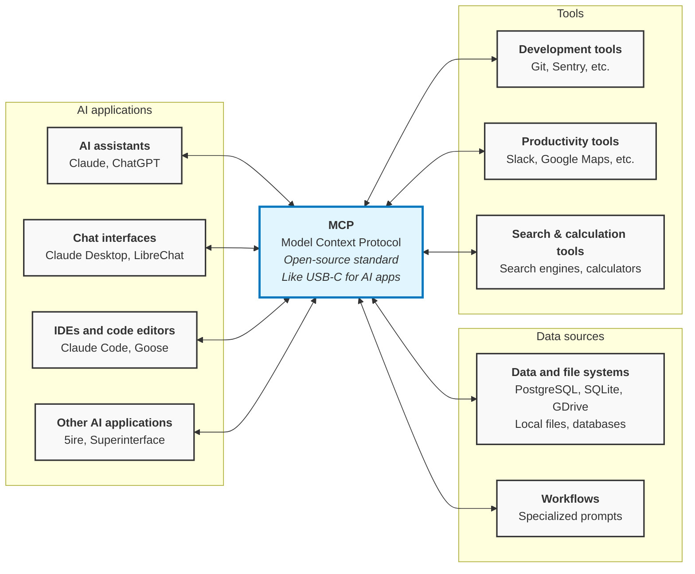

[← Documentation Map](documentation-map.md)

Source: https://modelcontextprotocol.io/docs/getting-started/intro

# What is the Model Context Protocol (MCP)?

MCP (Model Context Protocol) is an open-source standard for connecting AI applications to external systems.

Using MCP, AI applications like Claude or ChatGPT can connect to data sources (e.g. local files, databases), tools (e.g. search engines, calculators) and workflows (e.g. specialized prompts)—enabling them to access key information and perform tasks.

Think of MCP like a USB-C port for AI applications. Just as USB-C provides a standardized way to connect electronic devices, MCP provides a standardized way to connect AI applications to external systems.

## What can MCP enable?

| Use Case | Tools Used | What Happens | Outcome |
|----------|-------------|--------------|---------|
| **Personal Assistant** | Google Calendar, Notion | Agents access data | More personalized AI |
| **Web Development** | Claude Code, Figma | Generate from design | Complete web app |
| **Enterprise Analysis** | Multiple org databases | Chatbots connect all | Data analysis via chat |
| **3D Manufacturing** | Blender, 3D printer | AI designs + prints | Physical 3D objects |

## Why does MCP matter?

Depending on where you sit in the ecosystem, MCP can have a range of benefits.

| Stakeholder | Current Pain | MCP Benefit | Result |
|-------------|--------------|-------------|--------|
| **Developers** | Complex AI integration | Reduces dev time/complexity | Faster AI app builds |
| **AI Applications** | Limited capabilities | Access to data/tools ecosystem | Enhanced user experience |
| **End Users** | Basic AI functionality | AI gets data access + actions | More capable AI assistants |

## Start Building

| Build What | Purpose | Details | Guide |
|------------|---------|---------|-------|
| **MCP Servers** | Expose your data/tools | Make resources available to AI | [Build Guide](docs/develop/build-server.md) |
| **MCP Clients** | Connect to servers | Apps that use MCP servers | [Build Guide](docs/develop/build-client.md) |

## Learn more

| Topic | What You'll Learn | Resource |
|-------|------------------|----------|
| **Core Concepts** | MCP architecture & how it works | [Architecture Guide](docs/learn/architecture.md) |
